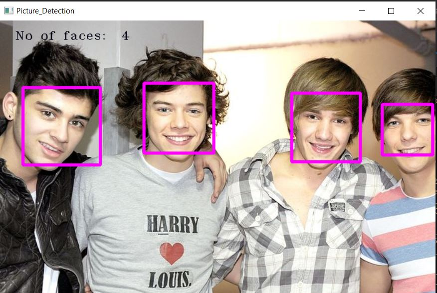

# Real-time-Face-Recognition-OpenCV 4.5.1 & C++
 
### Recognize and manipulate the Faces using Face-Recogniton Application System.
- Program recognizes faces in a live webcam stream.
- Using pre-trained XML classifiers.
- HaarCascades Classifiers.
- Upload Images for Multiple Face-detection.

# Features

# Installation
## Requirements
- [OpenCV 4.5.1](https://opencv.org/)
- [Visual Studio 2019](https://visualstudio.microsoft.com/)
- [HaarCascade_Frontal_Face Classifiers]()
## Setup

# Follow-Us

- [Aarush Srivastava](https://twitter.com/aarushsrivast17?s=08)
- [Nitish Sharma](https://twitter.com/itsnitish22)

- [Aarush](https://www.linkedin.com/in/aarush-srivastava/) 
- [Nitish](https://www.linkedin.com/in/itsnitish22/)
